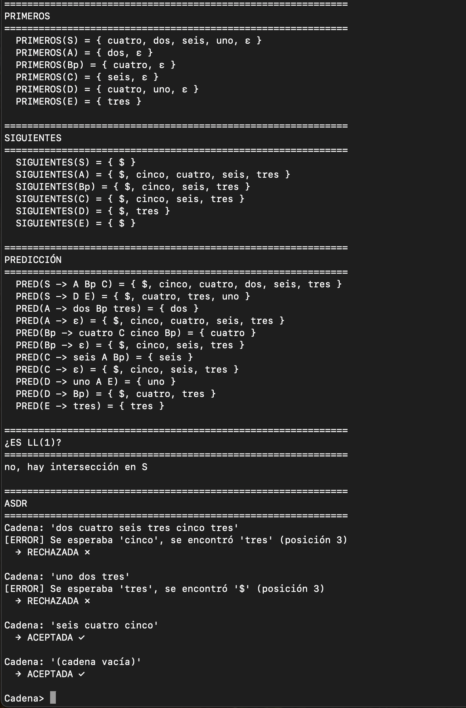
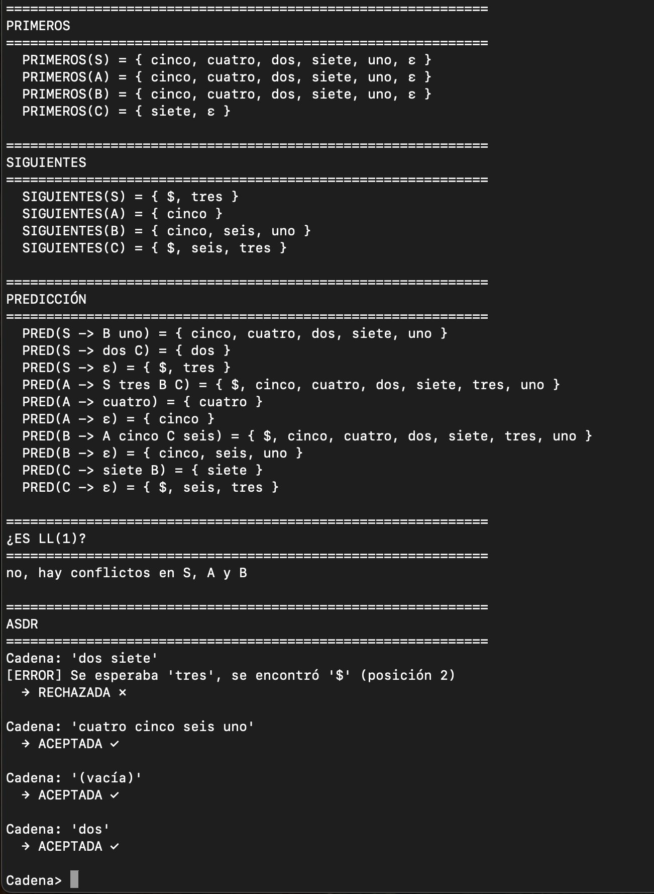
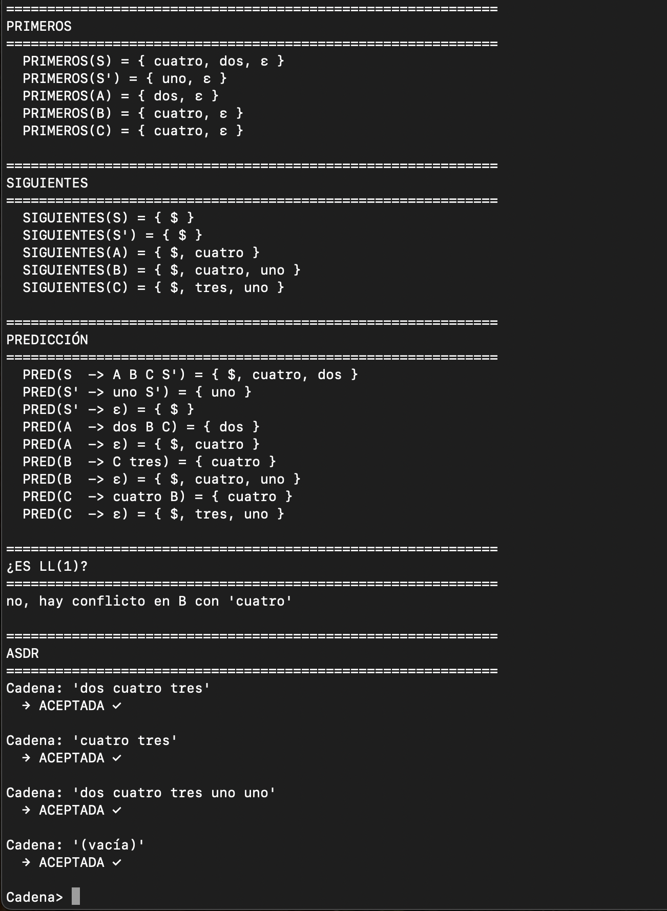

# INTRODUCCION

Este repositorio contiene la solución completa a los tres ejercicios de Análisis Sintáctico Descendente (ASD) propuestos en clase. Para cada ejercicio se implementa en Python:

- Eliminación de recursividad por la izquierda (cuando aplica)
- Cálculo de conjuntos PRIMEROS
- Cálculo de conjuntos SIGUIENTES
- Cálculo de conjuntos de Predicción
- Análisis de si la gramática es LL(1)
- Analizador Sintáctico Descendente Recursivo (ASDR) interactivo

# ESTRUCTURA DEL REPOSITORIO

ASD-Ejercicios/
├── README.md
├── ejercicio1/
│   └── ejercicio1.py
├── ejercicio2/
│   └── ejercicio2.py
├── ejercicio3/
│   └── ejercicio3.py
└── informe/
    └── informe_ASD.pdf

# EJERCICIOS

## Ejercicio 1

Gramática original:

S → A B C      S → D E  
A → dos B tres A → ε  
B → B cuatro C cinco  
B → ε  
C → seis A B   C → ε  
D → uno A E    D → B  
E → tres  

Tareas:

- Eliminar recursividad izquierda (en B)
- Calcular PRIMEROS, SIGUIENTES y Predicción
- Determinar si es LL(1)
- Implementar ASDR

Tokens válidos:  
uno dos tres cuatro cinco seis

### Ejecución

---

## Ejercicio 2

Gramática original:

S → B uno      S → dos C     S → ε  
A → S tres B C A → cuatro    A → ε  
B → A cinco C seis           B → ε  
C → siete B    C → ε  

Tareas:

- Calcular PRIMEROS, SIGUIENTES y Predicción
- Determinar si es LL(1)
- Implementar ASDR

Tokens válidos:  
uno dos tres cuatro cinco seis siete

### Ejecución

---

## Ejercicio 3

Gramática original:

S → A B C      S → S uno  
A → dos B C    A → ε  
B → C tres     B → ε  
C → cuatro B   C → ε  

Tareas:

- Eliminar recursividad izquierda (en S)
- Calcular PRIMEROS, SIGUIENTES y Predicción
- Determinar si es LL(1)
- Implementar ASDR

Tokens válidos:  
uno dos tres cuatro

### Ejecución

---

# COMO EJECUTAR

Requisitos:

- Python 3.6 o superior
- Sin dependencias externas

Ejecución:

# Ejercicio 1
python3 ejercicio1.py

# Ejercicio 2
python3 ejercicio2.py

# Ejercicio 3
python3 ejercicio3.py

# NOTAS TECNICAS

- Los terminales se representan como palabras en español: uno, dos, tres, etc.
- El símbolo ε indica producción vacía.
- El símbolo $ marca el fin de la cadena de entrada.
- Bp en el código representa B' (B prima).
- El analizador usa la primera producción en casos de ambigüedad.
